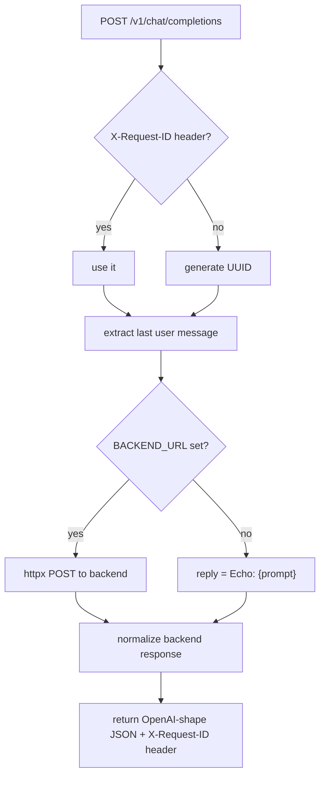

# Assignment 1: Minimal Inference Gateway

## File layout

```
assignments/assignment_1/
├── app.py              # entire application (~80 lines)
├── README.md           # run instructions, env vars, curl examples
└── test.sh             # curl-based smoke tests (objectives 2 & 3)
```

Dependencies added to `[pyproject.toml](pyproject.toml)`:

- `fastapi` — web framework
- `uvicorn` — ASGI server
- `httpx` — async HTTP client for backend forwarding

## `app.py` design

### Config (env vars)

- `PORT` — listen port, default `8080`
- `BACKEND_URL` — if set, forward to `{BACKEND_URL}/v1/chat/completions`; if unset, echo mode

### POST `/v1/chat/completions`

Request model:

```python
class Message(BaseModel):
    role: str
    content: str

class ChatRequest(BaseModel):
    messages: list[Message]
    stream: bool = False   # accepted but ignored (out of scope)
    model: str = "default"
```

Logic flow:




Response shape:

```json
{
  "id": "<request-id>",
  "object": "chat.completion",
  "choices": [{"message": {"role": "assistant", "content": "..."}, "finish_reason": "stop", "index": 0}],
  "usage": {"prompt_tokens": N, "completion_tokens": N, "total_tokens": N}
}
```

Token counts are approximated with `len(text.split())`.

### Optional GET `/healthz`

Returns `{"status": "ok"}` — cheap to add, useful for testing.

## `test.sh`

Two curl commands:

1. Echo mode (no backend) — checks `id` and `choices[0].message.content`
2. Passes a custom `X-Request-ID` — checks it is echoed back in the response `id` field
