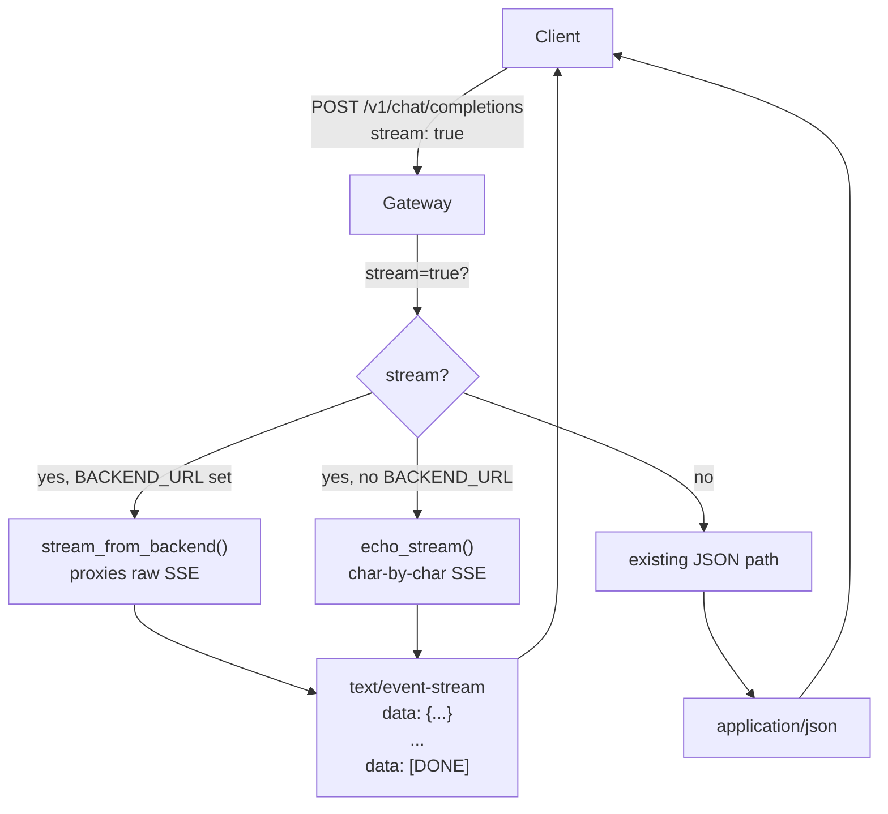

# SSE Streaming Support

## Overview

When `stream: true` is sent in the request body, the gateway returns `text/event-stream` SSE instead of a JSON object. Each character of the reply is emitted as a separate chunk, then `data: [DONE]` closes the stream.

Because the real backend may not support SSE yet, the task.md rule applies:

> If stream: true and the backend **does not** support streaming, return one SSE chunk with the full reply then `data: [DONE]`.

For the mock backend we will add genuine character-by-character streaming.

---

## SSE chunk format (OpenAI-compatible)

```json
data: {"id":"<req_id>","object":"chat.completion.chunk","choices":[{"index":0,"delta":{"role":"assistant","content":"<char>"},"finish_reason":null}]}

data: [DONE]
```

---

## Changes

### 1. `[models.py](assignments/assignment_1/models.py)` — add streaming models

Add two new models used only for SSE chunks:

```python
class DeltaMessage(BaseModel):
    role: str | None = None
    content: str | None = None

class StreamChoice(BaseModel):
    index: int = 0
    delta: DeltaMessage
    finish_reason: str | None = None
```

### 2. `[mock_backend.py](assignments/assignment_1/mock_backend.py)` — add streaming endpoint

Replace the single route with two behaviours based on `request.stream`:

- If `stream=False` → existing JSON response (unchanged).
- If `stream=True` → return a `StreamingResponse` (`text/event-stream`) that yields `"Mock"` one character at a time, then `data: [DONE]`.

```python
from fastapi.responses import StreamingResponse
import asyncio, json

async def char_stream(text: str, req_id: str):
    for char in text:
        chunk = {"id": req_id, "object": "chat.completion.chunk",
                 "choices": [{"index": 0, "delta": {"content": char}, "finish_reason": None}]}
        yield f"data: {json.dumps(chunk)}\n\n"
        await asyncio.sleep(0)   # yield to event loop
    yield "data: [DONE]\n\n"
```

### 3. `[gateway_logic.py](assignments/assignment_1/gateway_logic.py)` — add `stream_from_backend` + `echo_stream`

- `stream_from_backend(client, backend_url, request, req_id, timeout)` — opens an `httpx` streaming request to the backend and **passes the raw SSE lines through** to an async generator.
- `echo_stream(content, req_id)` — takes a plain string and yields it character-by-character as SSE chunks, then `[DONE]`. Used when `BACKEND_URL` is not set, or as the fallback when the backend returns non-streaming.

### 4. `[app.py](assignments/assignment_1/app.py)` — branch on `request.stream`

Inside `chat_completions`, after determining `prompt`:

```python
if request.stream:
    async def event_generator():
        if BACKEND_URL:
            async for chunk in stream_from_backend(...):
                yield chunk
        else:
            async for chunk in echo_stream(f"Echo: {prompt}", req_id):
                yield chunk

    return StreamingResponse(
        event_generator(),
        media_type="text/event-stream",
        headers={"X-Request-ID": req_id},
    )
# else: existing non-streaming path unchanged
```

---

## Data flow




---

## Files touched (summary)

- `models.py` — add `DeltaMessage`, `StreamChoice`
- `mock_backend.py` — add SSE streaming when `request.stream=True`
- `gateway_logic.py` — add `stream_from_backend`, `echo_stream`
- `app.py` — branch on `request.stream`, return `StreamingResponse`

