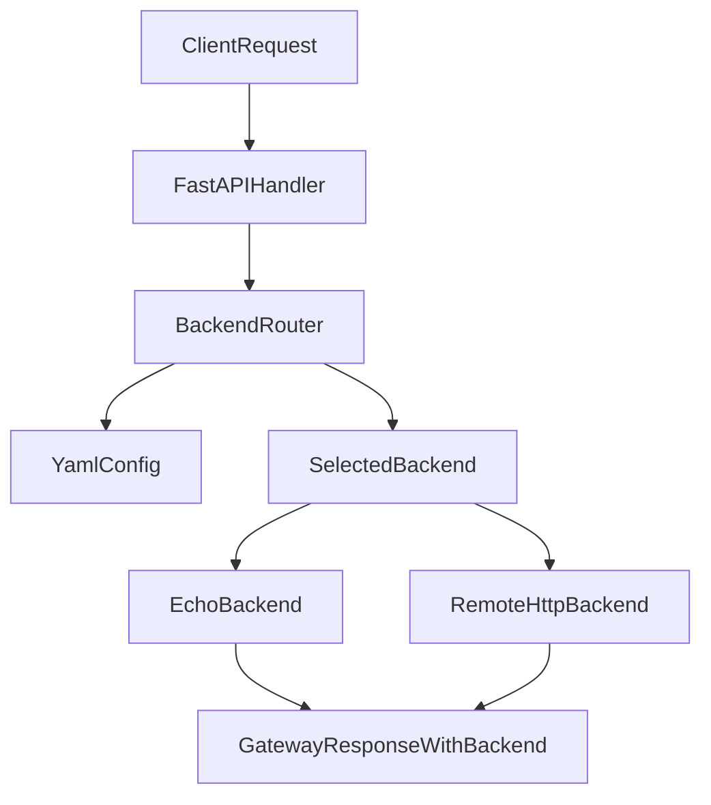

# Assignment 2 Must-Have Plan

## Goal

Extend the existing Class 1 gateway in [app.py](/Users/piotr/Desktop/maven-inferencing/inferencing-maven-assignments/src/app.py) into a minimal, clean, config-driven gateway that:

- routes by request `model`
- supports exactly two backend implementations for now: `local` and `remote`
- falls back to a configured default backend
- returns the selected backend name in the response
- keeps the handler/backend interaction backend-agnostic via a single `generate(prompt)` interface

The plan intentionally excludes optional stretch items and explicit out-of-scope topics from the brief: third backend support in code, `/v1/backends`, latency logging, retries/failover, load balancing, queues, workers, and streaming.

## Recommended Implementation Shape

Use the current FastAPI app and Pydantic request/response models as the base, but insert a thin backend abstraction layer between the HTTP handler and backend execution.

## File-Level Plan

1. Refactor [app.py](/Users/piotr/Desktop/maven-inferencing/inferencing-maven-assignments/src/app.py)

- Remove the current single `BACKEND_URL` decision path from the core request handler.
- Keep the existing HTTP surface: `POST /v1/chat/completions`, request-id handling, prompt extraction, and JSON response handling.
- Change the handler so it only:
  - extracts the prompt
  - resolves the backend name from `request.model` or default fallback
  - calls `await backend.generate(prompt)`
  - builds the response including `backend=<selected-backend-name>`
- Treat non-streaming as the supported assignment path; do not evolve streaming further for this assignment.

1. Introduce backend abstractions in a new module such as [backends.py](/Users/piotr/Desktop/maven-inferencing/inferencing-maven-assignments/src/backends.py)

- Add a backend interface/base class with one async method: `generate(prompt)`.
- Implement `EchoBackend` for the local path.
- Implement `RemoteHttpBackend` for HTTP POST forwarding to a configured URL.
- Keep backend-specific logic inside backend classes so the handler never branches on backend type.

1. Extend models in [models.py](/Users/piotr/Desktop/maven-inferencing/inferencing-maven-assignments/src/models.py)

- Add `backend: str` to the gateway response model.
- Add Pydantic config models for YAML parsing, for example:
  - app/default backend config
  - backend entry config with `type` and `url`
- Keep request/response modeling minimal and clean; reuse existing message, choice, and usage models where possible.

1. Simplify shared logic in [gateway_logic.py](/Users/piotr/Desktop/maven-inferencing/inferencing-maven-assignments/src/gateway_logic.py)

- Keep reusable helpers such as prompt extraction and response normalization.
- Update normalization so it can include backend metadata.
- Move raw remote HTTP call behavior behind `RemoteHttpBackend`, leaving `gateway_logic.py` focused on shared pure helpers instead of backend selection.

1. Add YAML config deliverable

- Add a sample config file, likely [config.yaml](/Users/piotr/Desktop/maven-inferencing/inferencing-maven-assignments/config.yaml), with the structure you requested:
  - `default_backend: local`
  - named backend entries under `backends`
- For must-have implementation, wire at least the `local` and one remote backend entry used by the gateway.
- Use the existing [mock_backend.py](/Users/piotr/Desktop/maven-inferencing/inferencing-maven-assignments/src/mock_backend.py) as the planned remote target for local demonstration/testing.
- Keep dependencies minimal: if YAML is used at runtime, add only one lightweight YAML parser and avoid broader config frameworks unless clearly necessary.

1. Update deliverables in [README.md](/Users/piotr/Desktop/maven-inferencing/inferencing-maven-assignments/src/README.md) and [test.sh](/Users/piotr/Desktop/maven-inferencing/inferencing-maven-assignments/src/test.sh)

- README should explicitly cover:
  - how to run the gateway
  - how to run the mock remote backend
  - how to point the gateway at the YAML config
  - how to run in echo/local-only mode
  - required config shape and example values
  - group member section for submission
- Test/demo script or curl section should demonstrate:
  - `model: local` routes to local/echo and returns `backend: local`
  - `model: remote` routes to mock remote and returns `backend: remote`
  - omitted or unknown `model` falls back to default backend

## Key Design Rules To Preserve

- The handler must never branch on backend implementation type.
- Adding another backend later should mean:
  - one new backend class if a new backend type is needed
  - one new config entry if reusing an existing backend class
- Hardcoded backend URLs or backend-name logic should not live in the request handler.
- Keep the code minimal and readable rather than over-abstracted.

## Minimal Target Changes

- Reuse existing strengths from assignment_1:
  - FastAPI app lifecycle and shared `httpx.AsyncClient`
  - Pydantic request/response models
  - prompt extraction and usage normalization
  - mock remote backend for testing
- Replace only the parts that block assignment_2 success criteria:
  - single `BACKEND_URL` global switch
  - inline echo-vs-remote branching in the handler
  - missing backend metadata in responses
  - missing named config-driven routing

## Acceptance Checklist

The implementation should be considered complete only when these must-have outcomes are satisfied:

- `POST /v1/chat/completions` with `"model": "local"` returns 200 and includes `"backend": "local"`
- `POST /v1/chat/completions` with `"model": "remote"` returns the mock remote reply and includes `"backend": "remote"`
- missing or unrecognized `model` cleanly falls back to the configured default backend
- backend routing is driven by YAML config, not hardcoded handler logic
- the reviewer can see a clear backend interface and two concrete implementations
- README and sample config are sufficient for someone else to run and verify the assignment quickly

